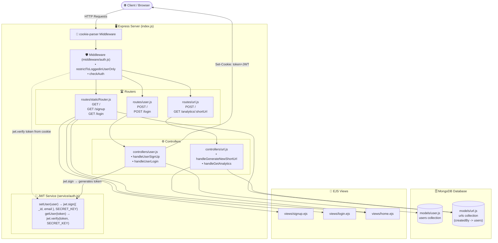
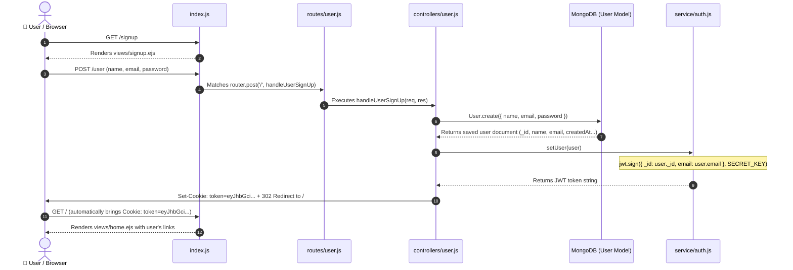
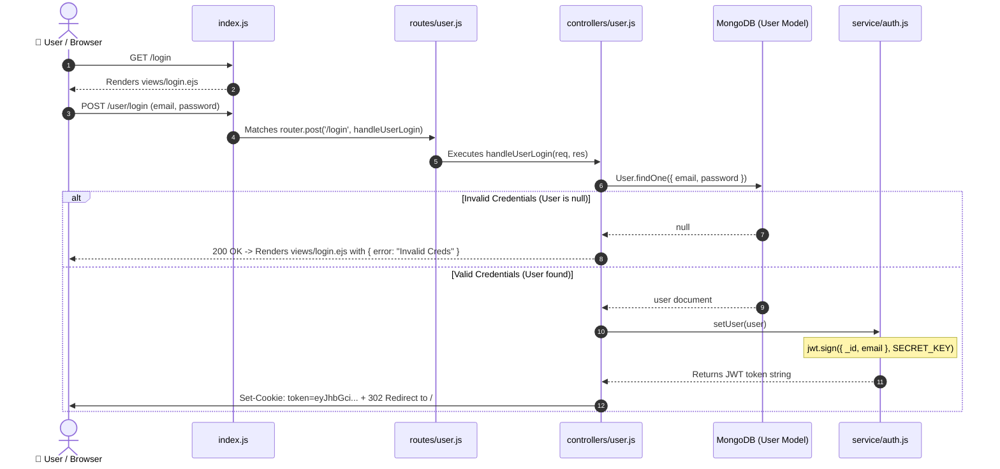
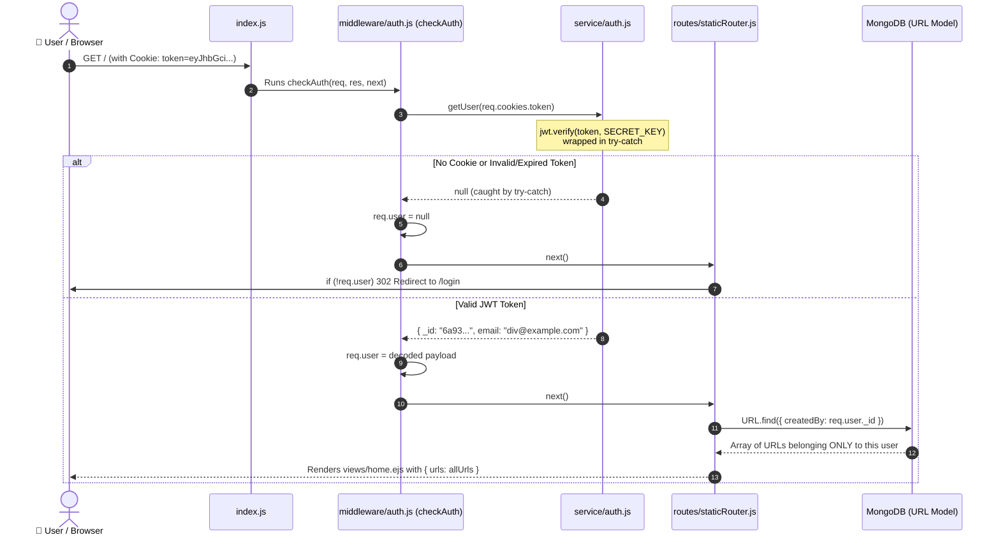
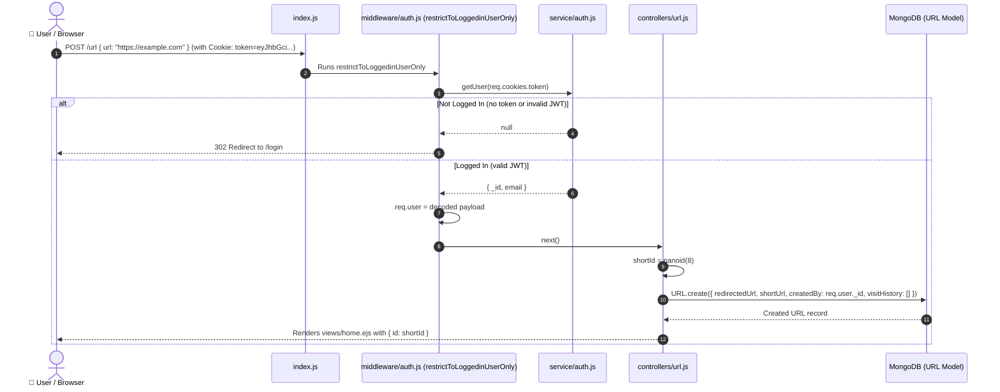
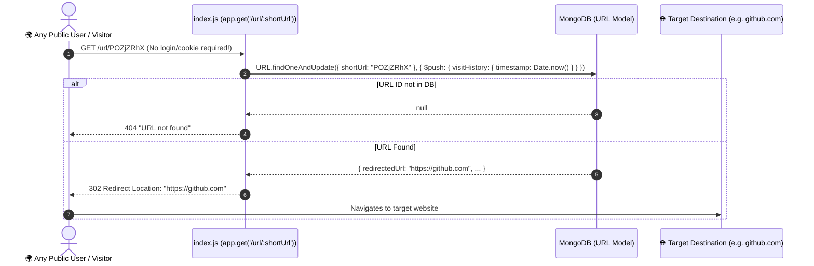

# 🔐 Complete Authentication & Authorization Flow Documentation

This document explains the complete authentication and authorization architecture implemented in the **Short URL** application, detailing every file, interaction, data structure, and request lifecycle.

> **Auth Approach**: JWT (JSON Web Token) — Stateless authentication. No server-side session store needed. The token itself carries the user's identity.

---

## 🗺️ 1. High-Level System Architecture & File Connections



---

## 🔄 2. Stateless vs Stateful Auth — What Changed

| Feature | Old (Map-based / Stateful) | New (JWT / Stateless) |
| :--- | :--- | :--- |
| **Session Store** | `new Map()` in `service/auth.js` | No server store needed — token is self-contained |
| **Cookie Value** | Random UUID (`uuidv4()`) | JWT string (`eyJhbGci...`) |
| **Cookie Name** | `uid` | `token` |
| **setUser()** | `setUser(sessionId, user)` — saves to Map | `setUser(user)` — returns signed JWT |
| **getUser()** | `getUser(id)` — looks up from Map | `getUser(token)` — decodes & verifies JWT |
| **Server Restart** | ❌ All sessions lost (Map clears) | ✅ Sessions survive (token is on client) |
| **Scalability** | ❌ Sessions tied to single server | ✅ Any server can verify the token |

### How JWT Works (Simplified):

```
┌─────────────────────────────────────────────────────────┐
│                    JWT Token Structure                    │
│                                                          │
│  eyJhbGciOiJIUzI1NiJ9.                    ← Header      │
│  eyJfaWQiOiI2YTkzMzhkZmYyNmJmYTk0MWY4   ← Payload     │
│  Yzk5NmMiLCJlbWFpbCI6ImRpdkBleGFtcGxl    (_id, email)  │
│  LmNvbSJ9.                                              │
│  sG8x2kR7mN3pQz...                        ← Signature   │
│                                            (SECRET_KEY)  │
└─────────────────────────────────────────────────────────┘

jwt.sign({ _id, email }, SECRET_KEY)  →  Creates the token
jwt.verify(token, SECRET_KEY)         →  Decodes & validates it
```

---

## 🔄 3. Detailed Flows Step-by-Step

### A. Signup & Auto-Login Flow



---

### B. Login Flow



---

### C. Dashboard Request Flow (`GET /` - Protected with `checkAuth`)



---

### D. URL Creation Flow (`POST /url` - Protected with `restrictToLoggedinUserOnly`)



---

### E. Public Short URL Redirection (`GET /url/:shortUrl`)



---

## 📁 4. File-by-File Breakdown & Inner Mechanics

### 1. `models/user.js`
- **Purpose**: Defines the User schema in MongoDB.
- **Fields**:
  - `name` (String, required)
  - `email` (String, required, `unique: true`) — ensures duplicate accounts cannot be made with the same email.
  - `password` (String, required) — stored credential.
  - `{ timestamps: true }` — automatically tracks `createdAt` and `updatedAt`.

### 2. `service/auth.js` — JWT Token Service
- **Purpose**: Stateless JWT-based authentication. No server-side storage needed.
- **Inner Mechanics**:
  - **`setUser(user)`**: Takes the user document, extracts `{ _id, email }`, and signs a JWT using `jwt.sign(payload, SECRET_KEY)`. Returns the token string.
  - **`getUser(token)`**: Takes the JWT token string from the cookie, runs `jwt.verify(token, SECRET_KEY)` inside a `try-catch`. Returns the decoded payload `{ _id, email }` on success, or `null` on failure (expired/malformed/tampered token).
  - **`SECRET_KEY`**: The secret used to sign and verify tokens. If this key changes, all existing tokens become invalid.

### 3. `controllers/user.js`
- **`handleUserSignUp`**:
  - Extracts `{ name, email, password }` from `req.body`.
  - Creates user in MongoDB.
  - Generates JWT token via `const token = setUser(user)`.
  - Attaches HTTP response cookie `res.cookie("token", token)`.
  - Redirects to `/`.
- **`handleUserLogin`**:
  - Searches DB: `User.findOne({ email, password })`.
  - If invalid: renders `login.ejs` with `{ error: "Invalid Creds" }`.
  - If valid: generates JWT token via `const token = setUser(user)`, sets `token` cookie, and redirects to `/`.

### 4. `middleware/auth.js`
- **`restrictToLoggedinUserOnly` (Strict Guard)**:
  - Reads `req.cookies?.token`.
  - Verifies JWT via `getUser(token)`.
  - If missing/invalid → immediately redirects to `/login`.
  - If valid → assigns `req.user = decoded payload` and calls `next()`.
  - *Applied to*: `POST /url` (only logged-in users can generate links).
- **`checkAuth` (Soft Guard)**:
  - Reads `req.cookies?.token`.
  - Verifies JWT via `getUser(token)`.
  - Attaches `req.user = decoded payload` (can be `null` if guest).
  - **Always calls `next()` without blocking**.
  - *Applied to*: `app.use("/", checkAuth, staticRoute)` so `/login` and `/signup` can open freely, while `/` can conditionally check `req.user`.

### 5. `models/url.js`
- **`createdBy` Reference**:
  ```javascript
  createdBy: {
      type: mongoose.Schema.Types.ObjectId,
      ref: "users"
  }
  ```
  Links each shortened URL to the `_id` of the user who generated it.

### 6. `routes/staticRouter.js`
- **`GET /`**:
  - Checks `if (!req.user) return res.redirect("/login")`.
  - Queries `URL.find({ createdBy: req.user._id })` so users only see their own URLs.
  - Renders `home.ejs`.
- **`GET /signup`**: Renders `signup.ejs`.
- **`GET /login`**: Renders `login.ejs`.

### 7. `index.js` (Master Assembly)
- **Middleware Order**:
  1. `express.json()` & `express.urlencoded({ extended: false })` (Parses JSON & form bodies into `req.body`).
  2. `cookieParser()` (Parses HTTP Cookie headers into `req.cookies`).
  3. `app.get('/url/:shortUrl', ...)` (Public redirect placed **before** auth middleware).
  4. `app.use("/url", restrictToLoggedinUserOnly, urlRoute)`.
  5. `app.use("/user", userRoute)`.
  6. `app.use("/", checkAuth, staticRoute)`.
